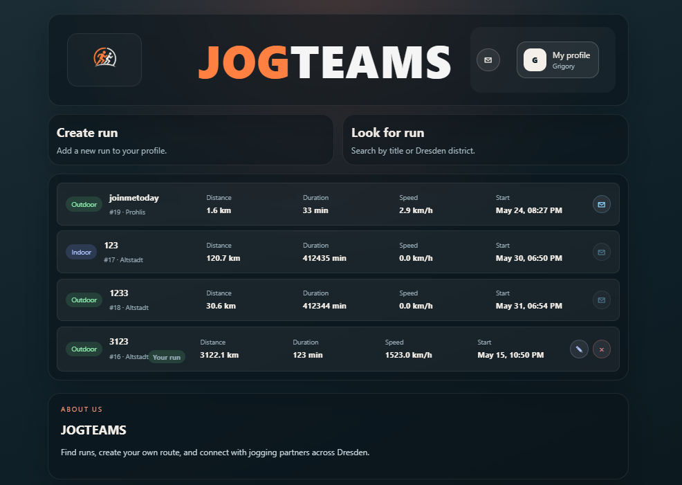
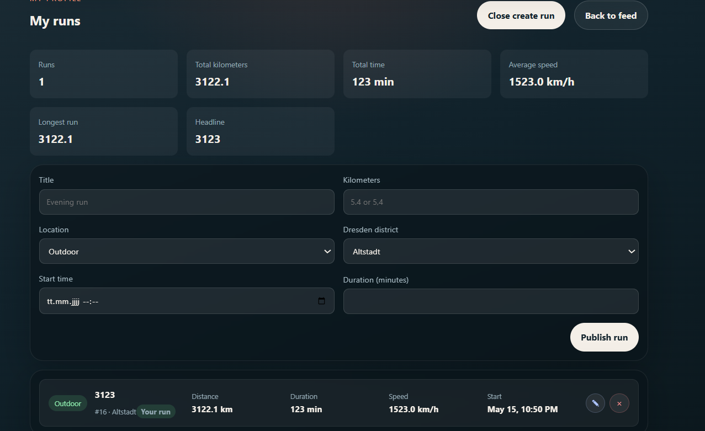
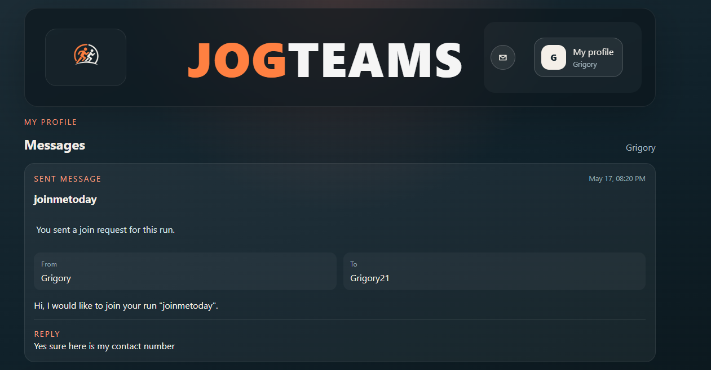
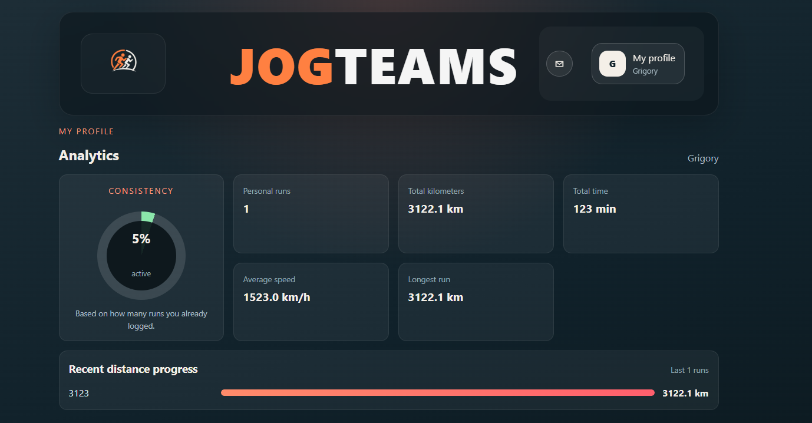

# JogTeams

JogTeams is a backend-driven web application for organizing social running sessions.
Users can create runs, discover runs, request to join, and communicate through in-app messages.

## Core Functions

- Google OAuth login
- Nickname setup and profile display
- Create, edit, and delete own runs
- Browse and filter run feed
- Join request messaging between runners
- Reply to join requests
- Unread message badge in UI
- Email notification for join requests
- Kafka event publishing and consuming for join notifications

## Tech Stack

- Java 21
- Spring Boot 4
- Spring Security (OAuth2 client)
- Spring JDBC / Data JDBC
- PostgreSQL
- Apache Kafka
- Docker Compose
- React + Vite
- Maven

## Architecture

Client:
- React frontend (`localhost:5173`)

Backend:
- Spring Boot API (`localhost:8080`)
- REST endpoints for auth, runs, and messages

Data and messaging:
- PostgreSQL for persistent data
- Kafka for asynchronous notification events

## Kafka Integration

When a user sends a join request:

1. Backend stores the message in PostgreSQL
2. Backend publishes event to topic `run-events`
3. Kafka consumer receives event
4. Consumer triggers organizer email notification

Kafka classes:

- `src/main/java/com/example/runnerz/kafka/RunJoinRequestedEvent.java`
- `src/main/java/com/example/runnerz/kafka/RunMessageKafkaProducer.java`
- `src/main/java/com/example/runnerz/kafka/RunJoinRequestedConsumer.java`
- `src/main/java/com/example/runnerz/kafka/KafkaTopicsConfig.java`

## Local Setup

## 1) Start containers

```bash
docker compose up -d postgres zookeeper kafka
```

## 2) Start backend

```powershell
.\start-oauth-backend.ps1
```

## 3) Start frontend

```powershell
cd frontend
npm run dev
```

## 4) Open app

- `http://localhost:5173`

## Configuration

Database defaults:

- Host: `localhost`
- Port: `5432`
- Database: `runnerz`
- User: `das`
- Password: `password`

Mail environment variables:

- `SPRING_MAIL_HOST`
- `SPRING_MAIL_PORT` (default `587`)
- `SPRING_MAIL_USERNAME`
- `SPRING_MAIL_PASSWORD`
- `SPRING_MAIL_SMTP_AUTH` (default `true`)
- `SPRING_MAIL_SMTP_STARTTLS` (default `true`)
- `APP_MAIL_FROM` (default `no-reply@jogteams.local`)

Kafka defaults:

- `SPRING_KAFKA_BOOTSTRAP_SERVERS=localhost:29092`
- `APP_KAFKA_TOPIC_RUN_EVENTS=run-events`
- `APP_KAFKA_GROUP_NOTIFICATIONS=runnerz-notification-group`

## API Overview

Auth:

- `GET /api/auth/me`
- `PUT /api/auth/nickname`

Runs:

- `GET /api/runs/future`
- `GET /api/runs/me`
- `POST /api/runs`
- `PUT /api/runs/{id}`
- `DELETE /api/runs/{id}`

Messages:

- `GET /api/messages`
- `GET /api/messages/unread-count`
- `POST /api/messages`
- `POST /api/messages/{id}/reply`
- `POST /api/messages/mark-read`

## Screenshots

### Main Page



### Run Creation



### Messages



### Analytics


